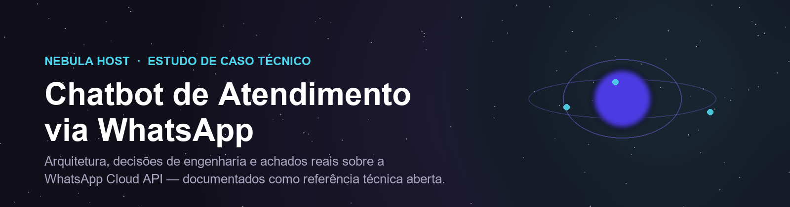
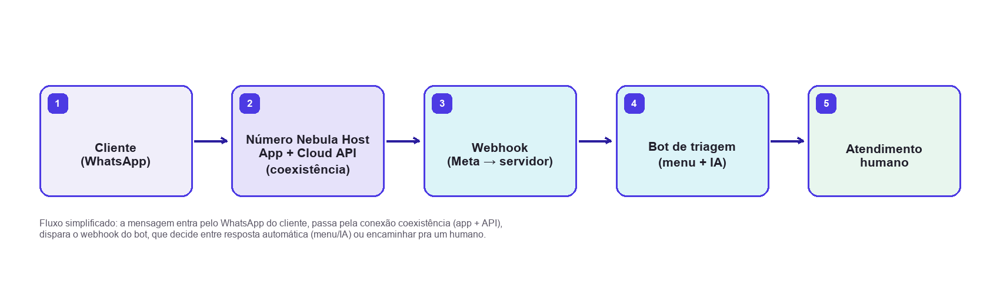
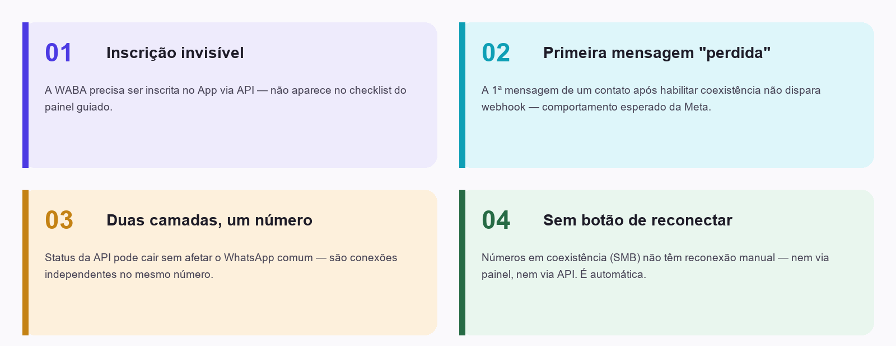
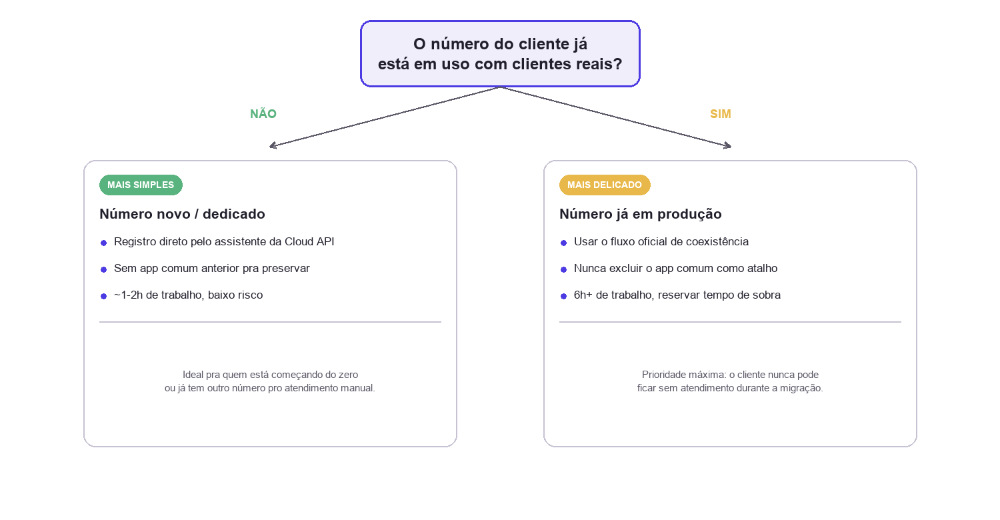

  

  
  
  
  
  

<i>Estudo de caso técnico: como automatizar atendimento via WhatsApp sem quebrar o canal que já está em produção.</i>

---

## Por que este repositório existe

A maior parte do conhecimento necessário pra implantar um chatbot de WhatsApp **sem derrubar o canal de atendimento de um negócio real** não está em nenhuma documentação oficial — foi aprendida na prática, incluindo um incidente real de indisponibilidade. Este repositório condensa essa experiência em três formatos:

|  |  |  |
|:---:|:---:|:---:|
| 🏗️ | **Arquitetura e decisões** | 5 ADRs completos — contexto, alternativas, trade-offs |
| 🔬 | **Achados empíricos** | 4 comportamentos da Cloud API que a Meta não documenta |
| 💼 | **Modelo de serviço** | Como isso virou uma oferta replicável pra outros negócios |

## Resumo

Este repositório documenta a concepção, arquitetura e implantação de um sistema de triagem automatizada de atendimento via WhatsApp, construído sobre a WhatsApp Cloud API oficial da Meta, com classificação de intenção por LLM (Claude) e handoff estruturado para atendimento humano.

> **Nenhum dado sensível aparece aqui.** Números de telefone, IDs de conta e tokens foram removidos de todos os exemplos — ver [Escopo e limitações](#escopo-e-limitações-deste-repositório).

## Arquitetura em um relance

  

## Stack tecnológica

| Camada | Tecnologia | Papel |
|---|---|---|
| 📲 Canal de mensageria | **WhatsApp Cloud API** (Meta, oficial) | Transporte de mensagens, sem risco de banimento associado a bibliotecas não-oficiais |
| ⚙️ Orquestração | **Node.js** (Express) | Webhook / Agent Bot que processa eventos de mensagem |
| 🧠 Classificação de intenção | **Claude API** (Anthropic), modelo Haiku | Triagem de FAQ e categorização de intenção com fallback para humano |
| 💬 Camada de atendimento | **Chatwoot** (self-hosted) | Inbox unificado, fila, histórico, automações, handoff bot→humano |
| 🖥️ Infraestrutura | **Docker Compose** sobre VPS | Hospedagem self-hosted, com foco em controle de dados (LGPD) |

## 🔬 Achados em destaque

A seção mais consultada deste repositório: comportamentos reais da WhatsApp Cloud API em modo de **coexistência**, observados empiricamente e não documentados de forma acessível pela Meta. Detalhamento completo em [`docs/05-descobertas-coexistencia-whatsapp.md`](docs/05-descobertas-coexistencia-whatsapp.md).

  

## A decisão que mais importa numa implantação real

  

Detalhada como ADR-002 em [`docs/03-decisoes-tecnicas.md`](docs/03-decisoes-tecnicas.md) — a escolha entre migração completa e modo de coexistência é o que mais determina o risco de uma implantação.

## 📚 Estrutura da documentação

| Documento | Conteúdo |
|---|---|
| [`01-motivacao.md`](docs/01-motivacao.md) | O problema de negócio e por que automação de **triagem** (não de todo o atendimento) foi o escopo escolhido |
| [`02-arquitetura.md`](docs/02-arquitetura.md) | Componentes, fluxo de dados, diagrama Mermaid |
| [`03-decisoes-tecnicas.md`](docs/03-decisoes-tecnicas.md) | 5 ADRs — contexto, alternativas consideradas, decisão, consequências |
| [`04-fases-de-implementacao.md`](docs/04-fases-de-implementacao.md) | Metodologia incremental, fase a fase |
| [`05-descobertas-coexistencia-whatsapp.md`](docs/05-descobertas-coexistencia-whatsapp.md) | Os 4 achados empíricos, com comandos reproduzíveis |
| [`06-licoes-aprendidas.md`](docs/06-licoes-aprendidas.md) | Catálogo de obstáculos operacionais reais e suas mitigações |
| [`07-modelo-de-servico.md`](docs/07-modelo-de-servico.md) | Como essa experiência virou um serviço replicável para terceiros |
| [`08-habilitacao-e-producao.md`](docs/08-habilitacao-e-producao.md) | Runbook: destravar a Cloud API (Tech Provider, coexistência, número novo), deploy na VPS e go-live |

## 🧰 Ferramentas

| Caminho | Conteúdo |
|---|---|
| [`scripts/diagnostico-whatsapp.sh`](scripts/diagnostico-whatsapp.sh) | Diagnóstico somente-leitura da conta na Graph API: token, WABA, inscrição, status do número, templates |
| [`deploy/`](deploy/) | Docker Compose de produção: Chatwoot + Postgres (pgvector) + Redis + Caddy (HTTPS) |

## ✅ Por que Cloud API oficial, não bibliotecas não-oficiais

| | Bibliotecas não-oficiais (Baileys, whatsapp-web.js) | WhatsApp Cloud API (Meta) |
|---|:---:|:---:|
| Risco de banimento do número | ❌ Alto — viola Termos de Serviço | ✅ Nenhum |
| Custo de configuração inicial | ✅ Baixo | ⚠️ Alto (processo administrativo da Meta) |
| Adequado pra número em produção | ❌ Não | ✅ Sim |
| Suporte a modo coexistência | ❌ Não existe | ✅ Sim |

Racional completo: ADR-001 em [`03-decisoes-tecnicas.md`](docs/03-decisoes-tecnicas.md).

## Escopo e limitações deste repositório

Este repositório contém documentação, um script de diagnóstico e os templates de infraestrutura. O código-fonte da implementação (webhook, integração com Chatwoot, testes de disponibilidade) é proprietário e não está incluído. Identificadores reais de conta (números de telefone, IDs de WhatsApp Business Account, tokens de acesso, endereços) foram removidos ou substituídos por placeholders em todos os exemplos — nenhuma credencial ou dado de cliente real aparece neste material.

## Autoria

**Nebula Host** — soluções de TI (suporte remoto, redes e infraestrutura, cibersegurança, projetos personalizados e automação de atendimento).

## Licença

O conteúdo textual e os diagramas deste repositório são disponibilizados para fins de referência técnica e estudo. Reprodução do conteúdo é permitida com atribuição.
