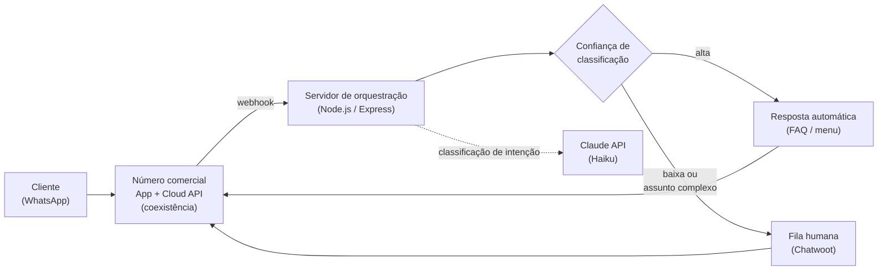

# 2. Arquitetura

## 2.1 Visão geral dos componentes

## 2.2 Componentes e responsabilidades

### Canal — WhatsApp Cloud API

A camada de transporte é a WhatsApp Cloud API oficial, mantida pela Meta. Essa escolha é discutida em detalhe na ADR-001 (`03-decisoes-tecnicas.md`); em resumo, é a única opção que não expõe o número comercial do cliente a risco de banimento por violação de termos de uso.

O número comercial opera em **modo de coexistência**: o aplicativo WhatsApp Business padrão (instalado no dispositivo móvel do proprietário do negócio) permanece funcional em paralelo ao acesso via Cloud API. Esse modo dual é o que permite que a migração para automação não exija desligar o canal de atendimento humano existente durante a transição.

### Orquestração — servidor Node.js (Agent Bot)

Um serviço HTTP em Node.js recebe eventos de mensagem via webhook (tanto diretamente da Meta quanto, na Fase 4, via webhook do Chatwoot) e executa a lógica de:

1. Verificação de webhook (handshake `hub.challenge`);
2. Interpretação do payload de mensagem recebida;
3. Consulta de correspondência direta com categorias pré-definidas (menu);
4. Fallback para classificação por LLM quando não há correspondência direta;
5. Envio de resposta (FAQ, menu de opções, ou encaminhamento) de volta ao canal.

### Classificação de intenção — Claude API

A classificação de intenção do usuário (qual categoria de serviço, e se a mensagem é uma pergunta de FAQ respondível automaticamente) é feita por um modelo de linguagem de porte pequeno (Claude Haiku), escolhido deliberadamente por custo-benefício para uma tarefa de classificação simples — a justificativa está detalhada na ADR-004. A saída do modelo é estruturada (schema fixo), não texto livre, para que o restante do pipeline possa tomar decisões determinísticas sobre o resultado.

### Camada de atendimento — Chatwoot (self-hosted)

Na arquitetura de produção (Fase 4), o Chatwoot atua como o proprietário da conexão com a WhatsApp Cloud API — não o servidor de orquestração diretamente. O servidor de orquestração passa a operar como um **Agent Bot** do Chatwoot: recebe eventos de `message_created` via webhook do Chatwoot, executa a mesma lógica de classificação, e responde via API do Chatwoot. Essa inversão de responsabilidade (Chatwoot como dono do canal, bot como consumidor de eventos) é justificada na ADR-003.

O Chatwoot fornece, além da automação, a camada de atendimento humano: fila, histórico por cliente, atribuição de conversas, e rótulos (labels) usados pelo próprio bot para marcar conversas como "aguardando triagem" ou "atendida".

### Infraestrutura — VPS com Docker Compose

O ambiente de produção roda em uma VPS via Docker Compose (Chatwoot + PostgreSQL + Redis + proxy reverso + o Agent Bot em container próprio). A escolha de hospedagem self-hosted em vez de SaaS é tratada na ADR-005, com foco em custo total de propriedade e em conformidade com a LGPD (dados de clientes sob controle direto do operador do sistema, não de terceiros).

## 2.3 Fluxo de dados de uma mensagem

1. O cliente envia uma mensagem de texto para o número comercial.
2. A Meta entrega o evento via webhook HTTP POST para o Chatwoot (que possui a inscrição ativa no WhatsApp Business Account correspondente).
3. O Chatwoot registra a mensagem na conversa e dispara um evento `message_created` para o Agent Bot, caso a conversa não esteja marcada como já atendida.
4. O Agent Bot verifica correspondência direta com uma categoria de menu; se não houver, invoca a API do Claude com o texto da mensagem e um contexto de FAQ pré-definido.
5. Dependendo do resultado (categoria identificada com alta confiança vs. baixa confiança/assunto complexo), o Agent Bot responde automaticamente ou aplica um rótulo que sinaliza necessidade de atendimento humano.
6. Toda a interação fica registrada no histórico do Chatwoot, visível para o atendente humano a qualquer momento.

## 2.4 Considerações de segurança e conformidade

- Preferência por self-hosting elimina a necessidade de compartilhar dados de conversas de clientes com plataformas SaaS de terceiros além da própria Meta (que já é parte necessária do canal) e da Anthropic (processamento de classificação, sem retenção de dados de treinamento por padrão contratual).
- Autenticação de webhook por token de verificação compartilhado, validado em toda requisição recebida.
- Uso de token de acesso permanente via **System User** do Business Manager, escopado às permissões mínimas necessárias (`whatsapp_business_messaging`, `whatsapp_business_management`), em vez de tokens de usuário pessoal.
